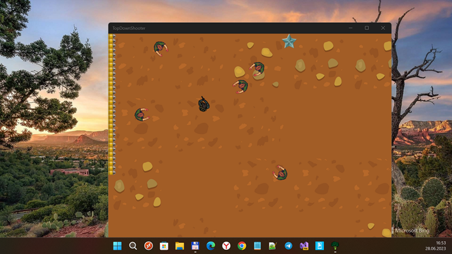

# W10MGameDevQuickie 1.0.0 (MonoGame2D tutorial projects/samples)

url: https://github.com/mediaexplorer74/W10MGameDevQuickie

page_type: sample

description: "LubiiiCZ's Quick Monogame2D-based game development tutorials planned to 
port on/to W10M."

languages: csharp

products: windows 10, windows 10 mobile

## About 
This is my experiment to run some simplest Desktop Monogame2D apps on/in W10M Astoria OS!:)

## Screenshots (Target: win 11 on desktop pc)

## Features
Min. Win. OS Build descreased to 10240 (Astoria Compatibility)

## Progress
- Q01-Q21 ported to UWP, but a lite incomplete (because of no TouchPanel "handlers" yet)
- P01 and P02 ported to UWP too (keyboard/mouse control only at now... no touch, heh!)

## Bugs / Errors
- SpriteFont mulfunction 
- Strange scene scaling (some error still here)
- Pixel Shaders (fx) incompatibility
- Map pathfinding seems to be broken ;(

## Requirements
This app requires Visual Studio 2022 Community to run. [Click here to learn how to get set up with Visual Studio](https://docs.microsoft.com/windows/uwp/get-started/get-set-up).

## Install and run the app
1. Install **MonoGame 3.6** for Visual Studio from [monogame.net](http://www.monogame.net/)
2. Clone or download this repository
3. Open **Src\W10MGameDevQuickie.sln** in Visual Studio.
4. Select Q21 and set this project as default app (project) for run or debug... 
5. To run the selected app, press **F5**. To quit, press **ESC**.

## Learn more about MonoGame UWP gamedev
For a step-by-step walkthrough of the code, check out the [MonoGame 2D tutorial on docs.microsoft.com](https://web.archive.org/web/20170907085024/https://docs.microsoft.com/en-us/windows/uwp/get-started/get-started-tutorial-game-mg2d).

## TODO
- Create Wiki.
- Refactor game control for better W10M support :)
- Refactor readme... and something else? 

## ..
As is. No support. For Learning purposes only.

## References
- https://www.youtube.com/@GameDevQuickie/videos LubiiiCZ's Monogame2D video-tutorials
- https://github.com/LubiiiCZ/DevQuickie The original GameDevQuickie
- https://github.com/LubiiiCZ LubiiiCZ, GameDevQuickie's creator/developer

## .
[m][e] 2023
