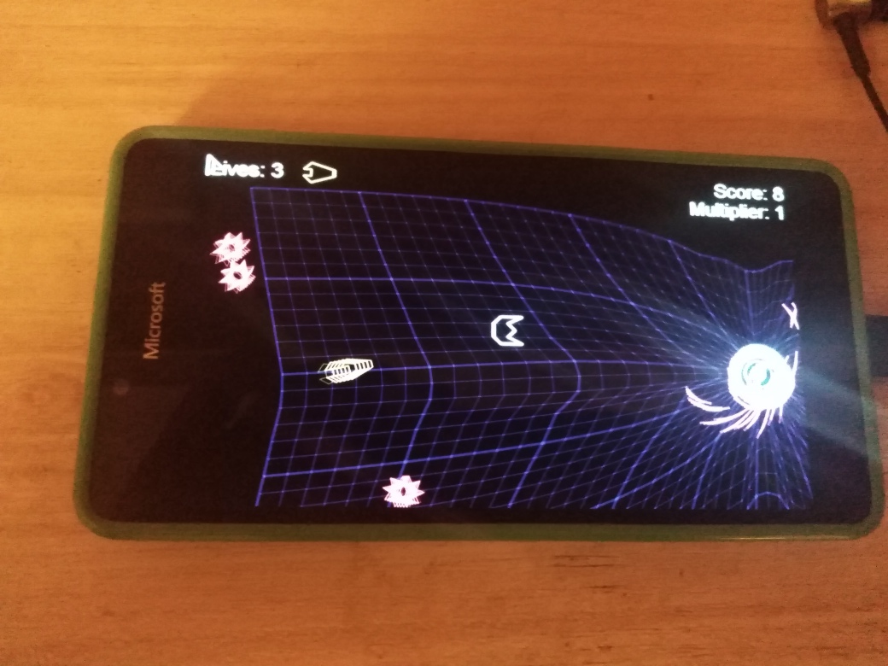
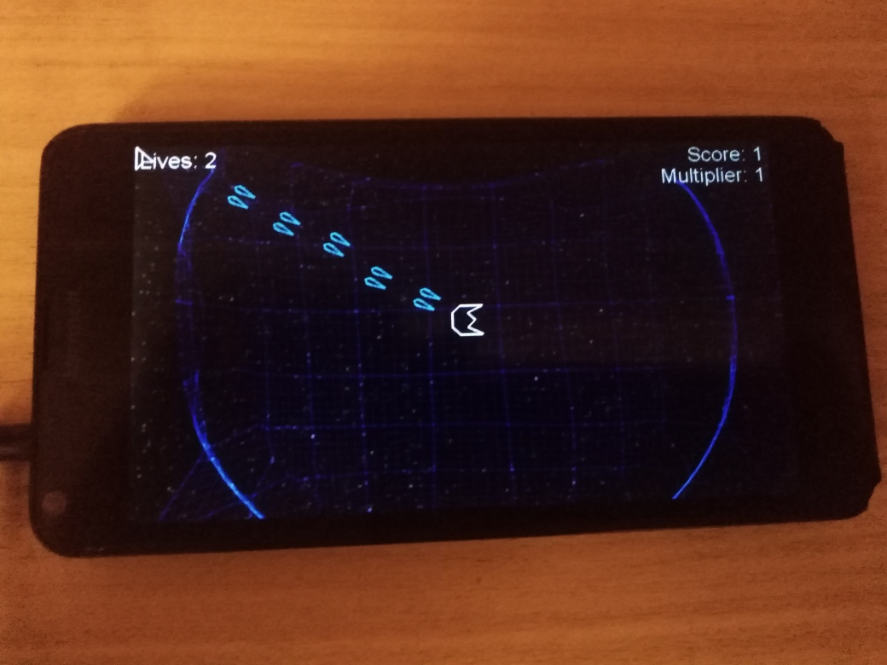
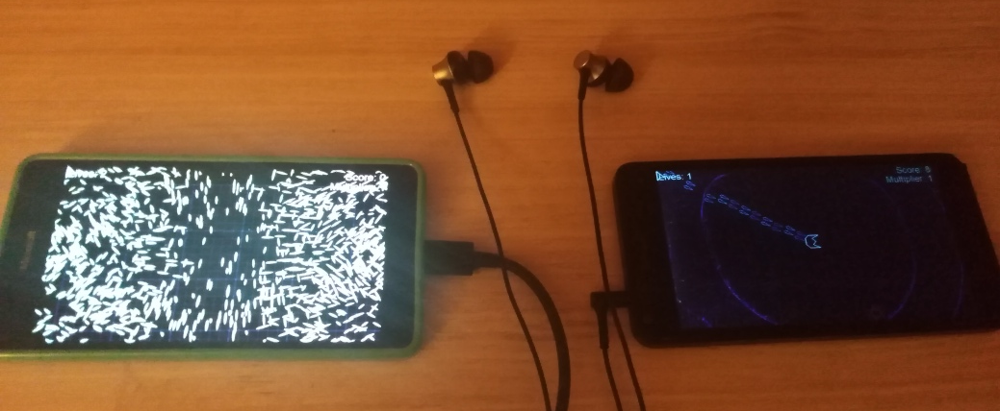

# GeoWar - Neon branch ("NeonShooter" v1.0.14.0)

## About
This is my *veeery quuuick* W10M port of [Nixxs's GeoWar](https://github.com/Nixxs/GeoWar) project. 
I mixed it with MonoGame NeonShooter game sample :)

Main goal: do some testing/exploration of new "native" (not mine/not tweaked) MonoGame.Framework.WindowsUniversal (v3.7.xx or v3.8.xx) package !

## Screenshot(s) 

## How to create this UWP XNA game?
Follow the Something Random youtube channel for development updates: 

https://www.youtube.com/channel/UCdbQJRNyC7JdgvsxZLNhCzw

## Status of my GeoWar porting
- Main W10M device : Lumia 950; sdk 15063+ (Last) - all ok and touchscreen reacted .. but no screen rescaling realized yet.
- Secondary W10M device : sdk 10240 (Astoria) - all ok but touchscreen not reacted (very strange... possible reason: not tweaked MonoGame.Framework.WindowsUniversal package!).
- Game sounds - fixed (some support of cool fx effects discovered...).
- Background music theme -- fixed!
- Game speed encreazed to better sync with music theme:)
- Original kbd control still presend for desktop mode. 
- Fullscreen mode not distorted "header"/"footer" -- so interesting :)
- Screen autosizing fixed (Game "autoscale" mode activated ))

## GameDev: How-to
https://gamedevelopment.tutsplus.com/tutorials/make-a-neon-vector-shooter-in-xna-basic-gameplay--gamedev-9859

## ToDo
- Explore TouchPanel deals
- Improve UI usability via some cool game mechanics (for example, on-screen buttons / virtual pad)

## References
- https://github.com/Nixxs/GeoWar Nixxs's GeoWar
- https://github.com/MonoGame/MonoGame.Samples MonoGame 2d platformer game samples 

## .
As is. Learn purposes only.

## ..
[m][e] Feb 2024
